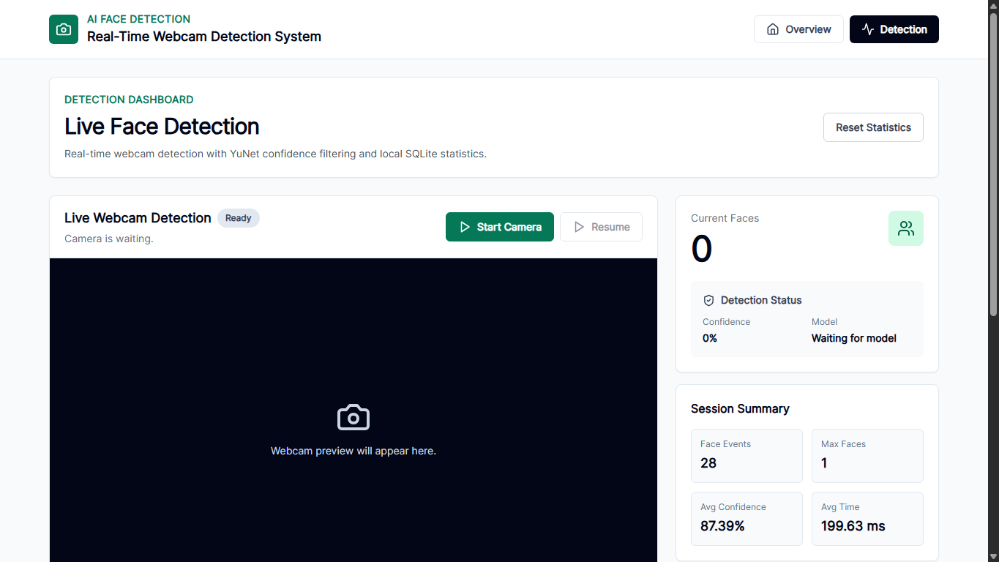
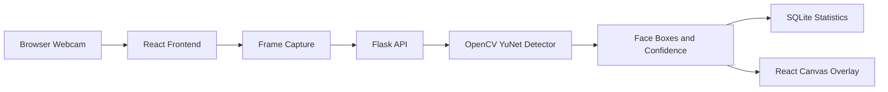

# AI-Based Real-Time Face Detection System

Professional real-time face detection web application using React, Flask,
OpenCV YuNet, and SQLite.

This project detects human faces from a live webcam feed, draws bounding boxes
around detected faces, counts faces, shows confidence scores, displays live
quality status, and stores detection statistics locally.



## Project Overview

This is a face detection system, not a face recognition system.

```text
Face detection: Finds faces and draws boxes around them.
Face recognition: Identifies who the person is.
```

This project only detects faces. It does not identify people by name.

## Key Highlights

- Real-time webcam face detection.
- OpenCV YuNet primary detection model.
- Haar Cascade fallback model.
- Confidence filtering to reduce wrong detections.
- Multiple face detection and counting.
- Simple face tracking IDs.
- Live dashboard with model, confidence, timing, and quality status.
- SQLite detection history.
- Accuracy evaluation script for labeled datasets.
- Measured accuracy results documented honestly without claiming 95%.
- Beginner-friendly and viva-friendly documentation.

## Technology Stack

| Layer | Technology | Purpose |
|---|---|---|
| Frontend | React.js | User interface |
| Frontend Tooling | Vite | Development and build system |
| Styling | Tailwind CSS | Responsive dashboard design |
| Icons | Lucide React | Professional UI icons |
| Backend | Python Flask | API server |
| AI/Computer Vision | OpenCV YuNet | Face detection |
| Fallback AI Model | Haar Cascade | Backup detection model |
| Database | SQLite | Local detection history |
| Data Processing | NumPy | Image array handling |

## Current Model

Primary model:

```text
OpenCV YuNet Face Detector
```

Model file:

```text
backend/models/face_detector_model/face_detection_yunet_2023mar.onnx
```

Fallback model:

```text
backend/models/haarcascade_frontalface_default.xml
```

## Main Features

| Feature | Status |
|---|---|
| Live webcam detection | Completed |
| Bounding box around face | Completed |
| Multiple face detection | Completed |
| Face counting | Completed |
| Confidence score | Completed |
| Face tracking ID | Completed |
| Live quality status | Completed |
| SQLite detection history | Completed |
| Reset statistics | Completed |
| Accuracy evaluation script | Completed |
| Accuracy result documentation | Completed |
| Professional README and docs | Completed |

## Final Project Status

This project is complete as a working real-time face detection system.

The system can:

- Open the webcam from the React frontend.
- Send webcam frames to the Flask backend.
- Detect faces using OpenCV YuNet.
- Draw face boxes on the webcam preview.
- Count detected faces.
- Show confidence, processing time, and quality status.
- Save frame-level detection history in SQLite.
- Run accuracy evaluation on labeled image datasets.

Important accuracy note:

```text
The project does not claim 95% accuracy.
The best measured report in this project is 91.15% detection accuracy
on the webcam-style WIDER FACE sample.
```

This keeps the project honest, examiner-safe, and professionally documented.

## System Architecture



## Workflow

```text
1. User opens the React dashboard.
2. User clicks Start Camera.
3. Browser asks for webcam permission.
4. React captures webcam frames.
5. React sends frames to Flask backend.
6. Flask converts each frame into an OpenCV image.
7. OpenCV YuNet detects faces.
8. Backend returns face boxes, count, confidence, and quality status.
9. React draws boxes over the webcam preview.
10. SQLite stores frame-level detection statistics.
```

## Folder Structure

```text
AI-Face-Detection-System/
|
|-- backend/
|   |-- app.py
|   |-- config.py
|   |-- database.py
|   |-- requirements.txt
|   |-- models/
|   |-- routes/
|   |-- services/
|
|-- frontend/
|   |-- src/
|   |   |-- components/
|   |   |-- pages/
|   |   |-- App.jsx
|   |   |-- main.jsx
|   |   |-- index.css
|   |-- package.json
|
|-- datasets/
|   |-- WIDER_FACE/
|   |-- FDDB/
|   |-- sample_annotations.csv
|
|-- docs/
|   |-- ACCURACY_EVALUATION.md
|   |-- DEPLOYMENT_GUIDE.md
|   |-- FINAL_CHECKLIST.md
|   |-- VIVA_EXPLANATION.md
|
|-- scripts/
|   |-- evaluate_accuracy.py
|
|-- screenshots/
|-- reports/
|-- README.md
|-- AGENTS.md
|-- .gitignore
```

## Important Files

| File | Purpose |
|---|---|
| `backend/app.py` | Starts Flask backend |
| `backend/config.py` | Stores model paths and detector settings |
| `backend/database.py` | Handles SQLite database operations |
| `backend/routes/detection.py` | Provides detection API routes |
| `backend/services/face_detector.py` | Runs YuNet/Haar face detection |
| `frontend/src/components/WebcamFeed.jsx` | Handles webcam and canvas overlay |
| `frontend/src/pages/Detection.jsx` | Main detection dashboard |
| `scripts/evaluate_accuracy.py` | Measures accuracy using labeled images |

## API Endpoints

Base URL:

```text
http://127.0.0.1:5000
```

| Method | Endpoint | Purpose |
|---|---|---|
| GET | `/api/health` | Backend and model status |
| POST | `/api/detection/frame` | Detect faces from one webcam frame |
| GET | `/api/detection/stats` | Dashboard statistics |
| GET | `/api/detection/history` | Recent detection records |
| POST | `/api/detection/reset` | Clear detection history |

## Run Project Locally

Use two PowerShell terminals.

### Terminal 1: Backend

```powershell
cd D:\AI-Face-Detection-System
python backend\app.py
```

Backend URL:

```text
http://127.0.0.1:5000
```

Health check:

```text
http://127.0.0.1:5000/api/health
```

### Terminal 2: Frontend

```powershell
cd D:\AI-Face-Detection-System\frontend
npm.cmd run dev
```

Frontend URL:

```text
http://127.0.0.1:5173
```

If Vite uses another port, open the port shown in the terminal.

## First-Time Setup

Backend packages:

```powershell
cd D:\AI-Face-Detection-System
python -m pip install -r backend\requirements.txt
```

Frontend packages:

```powershell
cd D:\AI-Face-Detection-System\frontend
npm.cmd install
```

## Verification Commands

Backend syntax check:

```powershell
cd D:\AI-Face-Detection-System
python -m compileall backend scripts
```

Frontend build check:

```powershell
cd D:\AI-Face-Detection-System\frontend
npm.cmd run build
```

Model status check:

```powershell
cd D:\AI-Face-Detection-System
python -c "import sys; sys.path.insert(0, 'backend'); from services.face_detector import FaceDetector; print(FaceDetector().get_status())"
```

Expected model:

```text
OpenCV YuNet Face Detector
```

## Accuracy Evaluation

The project includes a formal accuracy evaluation script and documented
measured results.

Annotation format:

```csv
image_path,x,y,width,height
datasets/sample_images/person_01.jpg,120,80,90,110
```

Run:

```powershell
cd D:\AI-Face-Detection-System
python scripts\evaluate_accuracy.py --annotations datasets\sample_annotations.csv
```

Output:

```text
reports/accuracy_report.json
```

Current measured results:

| Dataset Report | Images | Real Faces | Detection Accuracy | Precision | 95% Target |
|---|---:|---:|---:|---:|---|
| WIDER FACE sample | 100 | 324 | 51.85% | 100.00% | Not met |
| WIDER FACE closeup sample | 100 | 109 | 85.32% | 75.00% | Not met |
| WIDER FACE large sample | 100 | 167 | 88.62% | 67.27% | Not met |
| WIDER FACE webcam-style sample | 100 | 113 | 91.15% | 79.23% | Not met |

Correct project statement:

```text
This project is a completed real-time face detection system.
It has measured accuracy results, but it does not claim 95% accuracy.
```

More details:

```text
docs/ACCURACY_EVALUATION.md
```

## Dataset Plan

Prepared dataset folders:

```text
datasets/WIDER_FACE
datasets/FDDB
datasets/sample_images
```

Large dataset files are ignored by Git and should remain local.

## Screenshots

Generated screenshot:

```text
screenshots/dashboard-ready.png
```

Recommended additional screenshots:

```text
screenshots/live-detection.png
screenshots/history-section.png
screenshots/backend-health.png
```

More details:

```text
screenshots/README.md
```

## Security And Privacy

- No API key is required.
- No password is stored.
- No face image is stored by default.
- Browser controls webcam permission.
- The system detects faces only.
- It does not identify people.
- SQLite database files are ignored by Git.
- Raw datasets are ignored by Git.

## Troubleshooting

| Problem | Solution |
|---|---|
| Camera not opening | Allow webcam permission in browser |
| Frontend cannot detect | Make sure backend is running on port 5000 |
| Backend not loading | Run `python backend\app.py` |
| Frontend not loading | Run `npm.cmd run dev` inside `frontend` |
| Port 5173 busy | Use the Vite URL shown in terminal |
| Face not detected | Use better light and face the camera |
| Low confidence | Move closer and keep face clear |
| Old box after stop | Refresh page if browser cache shows old build |

## Documentation

| Document | Purpose |
|---|---|
| `docs/ACCURACY_EVALUATION.md` | Explains accuracy testing |
| `docs/ACCURACY_RESULTS.md` | Shows current measured accuracy results |
| `docs/VIVA_EXPLANATION.md` | Simple viva explanation |
| `docs/DEPLOYMENT_GUIDE.md` | Deployment preparation |
| `docs/FINAL_CHECKLIST.md` | Final submission checklist |

## Limitations

- Accuracy depends on lighting, camera quality, face angle, and distance.
- Very small or heavily covered faces may be missed.
- Current measured reports do not prove 95% accuracy.
- Webcam access needs localhost or HTTPS.
- The system does not perform identity recognition.

## Future Scope

- Add image upload detection.
- Add video upload detection.
- Add PDF report export.
- Add WIDER FACE automated parser.
- Improve model tuning if a verified 95% accuracy target is required.
- Deploy frontend and backend online.
- Add production WSGI server setup.

## Author

| Field | Details |
|---|---|
| Name | Suvodeep Roy |
| Course | Master of Computer Applications |
| College | Netaji Subhas Engineering College |
| Role | AI Enthusiast and Software Developer |
| GitHub | https://github.com/suvodeeproy94-tech |

## Repository

```text
https://github.com/suvodeeproy94-tech/AI-Face-Detection-System.git
```

## License

This project uses the MIT License.

## References

- OpenCV documentation
- OpenCV Zoo YuNet face detection model
- Flask documentation
- React documentation
- Vite documentation
- WIDER FACE dataset
- FDDB dataset
