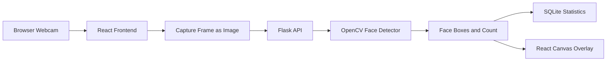

# AI-Based Real-Time Face Detection System

Real-time webcam face detection web application using React, Flask, OpenCV,
and SQLite.

This project detects human faces from a live webcam feed, draws bounding boxes
around detected faces, counts multiple faces, shows an estimated confidence
score, and stores simple detection statistics for review.

## Project Purpose

The purpose of this project is to build a beginner-friendly and professional
face detection system that can be explained easily during viva or project
presentation.

The system focuses on face detection only. It does not identify the person.

```text
Face detection: Finds where faces are present.
Face recognition: Identifies whose face it is.
```

This project performs face detection.

## Important Accuracy Note

The project is designed to target strong real-time face detection performance.
However, 95% accuracy can be claimed only after testing with a labeled dataset.

The current first version uses OpenCV Haar Cascade because it is lightweight
and suitable for an Intel Core i3 laptop with 8 GB RAM.

For stronger accuracy in difficult conditions, the model can later be upgraded
to OpenCV DNN, SSD, RetinaFace, or YOLO-based face detection.

## Main Features

| Feature | Description |
|---|---|
| Live webcam detection | Detects faces from the browser webcam |
| Multiple face detection | Detects more than one face in the same frame |
| Bounding box | Draws a green box around each face |
| Face counting | Shows the number of faces in the current frame |
| Face tracking | Gives a simple tracking ID to each face |
| Confidence score | Shows estimated confidence for each detection |
| Live statistics | Shows frame count, face count, confidence, and time |
| SQLite history | Saves simple detection records locally |
| React frontend | Provides a clean dashboard |
| Flask backend | Handles AI detection API requests |

## Technology Stack

### Frontend

| Technology | Purpose |
|---|---|
| React.js | Builds the user interface |
| Vite | Runs and builds the React app |
| JavaScript | Handles webcam logic and API calls |
| Tailwind CSS | Helps create responsive UI |
| Lucide React | Provides clean UI icons |

### Backend

| Technology | Purpose |
|---|---|
| Python | Backend programming language |
| Flask | Creates API routes |
| Flask-CORS | Allows frontend to call backend |
| OpenCV | Performs face detection |
| NumPy | Helps OpenCV handle image arrays |
| SQLite | Stores detection history |

## System Architecture



## Project Workflow

```text
1. User opens the React web application.
2. User clicks Start Camera.
3. Browser asks for webcam permission.
4. React captures webcam frames.
5. React sends each frame to the Flask backend.
6. Flask converts the frame into an OpenCV image.
7. OpenCV detects faces using Haar Cascade.
8. Backend returns face box positions and count.
9. React draws boxes on the video canvas.
10. Backend stores frame statistics in SQLite.
```

## Folder Structure

```text
AI-Face-Detection-System/
|
|-- datasets/
|   |-- WIDER_FACE/
|   |   |-- images/
|   |   |-- annotations/
|   |
|   |-- FDDB/
|       |-- images/
|       |-- annotations/
|
|-- frontend/
|   |-- public/
|   |-- src/
|   |   |-- components/
|   |   |   |-- DetectionHistory.jsx
|   |   |   |-- DetectionStats.jsx
|   |   |   |-- FaceCounter.jsx
|   |   |   |-- Navbar.jsx
|   |   |   |-- WebcamFeed.jsx
|   |   |
|   |   |-- pages/
|   |   |   |-- Detection.jsx
|   |   |   |-- Home.jsx
|   |   |
|   |   |-- App.jsx
|   |   |-- index.css
|   |   |-- main.jsx
|   |
|   |-- package.json
|   |-- vite.config.js
|
|-- backend/
|   |-- data/
|   |-- models/
|   |   |-- haarcascade_frontalface_default.xml
|   |   |-- face_detector_model/
|   |
|   |-- routes/
|   |   |-- detection.py
|   |
|   |-- services/
|   |   |-- face_detector.py
|   |
|   |-- app.py
|   |-- config.py
|   |-- database.py
|   |-- requirements.txt
|
|-- screenshots/
|-- AGENTS.md
|-- README.md
|-- .gitignore
```

## Important Files

| File | Purpose |
|---|---|
| `backend/app.py` | Starts the Flask backend |
| `backend/config.py` | Stores backend paths and settings |
| `backend/database.py` | Handles SQLite database work |
| `backend/routes/detection.py` | Defines face detection API routes |
| `backend/services/face_detector.py` | Contains OpenCV face detection logic |
| `frontend/src/components/WebcamFeed.jsx` | Handles webcam, frame capture, and box drawing |
| `frontend/src/pages/Detection.jsx` | Main detection dashboard page |
| `frontend/src/components/DetectionStats.jsx` | Shows live detection statistics |
| `frontend/src/components/FaceCounter.jsx` | Shows current face count |

## Database Documentation

The project uses SQLite because it is simple and does not need a separate
database server.

The database file is created automatically at:

```text
backend/data/face_detection_records.db
```

This file is ignored by Git because it is generated locally.

### Table: detection_records

| Column | Purpose |
|---|---|
| `id` | Unique record ID |
| `source_type` | Source of frame, currently webcam |
| `face_count` | Number of faces detected |
| `average_confidence` | Average estimated confidence |
| `processing_time_ms` | Backend processing time |
| `model_name` | Name of model used |
| `created_at` | Date and time of detection |

## API Documentation

Base backend URL:

```text
http://127.0.0.1:5000
```

| Method | Endpoint | Purpose |
|---|---|---|
| GET | `/api/health` | Checks if backend is running |
| POST | `/api/detection/frame` | Detects faces from one webcam frame |
| GET | `/api/detection/stats` | Returns saved detection statistics |
| GET | `/api/detection/history` | Returns recent detection records |
| POST | `/api/detection/reset` | Clears saved detection records |

### Example Frame Detection Request

```json
{
  "frame": "data:image/jpeg;base64,..."
}
```

### Example Frame Detection Response

```json
{
  "success": true,
  "message": "Face detection completed.",
  "data": {
    "faces": [
      {
        "x": 120,
        "y": 80,
        "width": 100,
        "height": 100,
        "confidence": 92.4,
        "tracking_id": 1
      }
    ],
    "face_count": 1,
    "average_confidence": 92.4,
    "processing_time_ms": 34.2,
    "frame_width": 640,
    "frame_height": 480,
    "model_name": "OpenCV Haar Cascade"
  }
}
```

## Dataset Information

For first development, datasets are not required immediately because OpenCV
already provides a pretrained Haar Cascade model.

Datasets are needed when you want to test and prove accuracy.

### WIDER FACE Dataset

Purpose:

```text
Training and testing face detection models.
```

Contains:

```text
32,203 images
393,703 labeled faces
```

Expected local path:

```text
D:\AI-Face-Detection-System\datasets\WIDER_FACE
```

### FDDB Dataset

Purpose:

```text
Testing and evaluating face detection models.
```

Contains:

```text
2,845 images
5,171 faces
```

Expected local path:

```text
D:\AI-Face-Detection-System\datasets\FDDB
```

## Installation Guide

### Prerequisites

Install these first:

| Tool | Purpose |
|---|---|
| Python 3.14+ | Runs Flask backend |
| Node.js | Runs React frontend |
| Git | Clones and pushes project |
| VS Code | Code editor |
| Webcam | Needed for live detection |

## Backend Setup

Open terminal in the project folder:

```bash
cd D:\AI-Face-Detection-System
```

Create a virtual environment:

```bash
python -m venv .venv
```

Activate it on Windows:

```bash
.venv\Scripts\activate
```

Install backend packages:

```bash
python -m pip install -r backend\requirements.txt
```

Start Flask backend:

```bash
python backend\app.py
```

Expected backend URL:

```text
http://127.0.0.1:5000
```

## Frontend Setup

Open a second terminal in the project folder:

```bash
cd D:\AI-Face-Detection-System\frontend
```

Install frontend packages:

```bash
npm.cmd install
```

Start React frontend:

```bash
npm.cmd run dev
```

Expected frontend URL:

```text
http://127.0.0.1:5173
```

## Running The Project

Use two terminals.

Terminal 1:

```bash
cd D:\AI-Face-Detection-System
python backend\app.py
```

Terminal 2:

```bash
cd D:\AI-Face-Detection-System\frontend
npm.cmd run dev
```

Then open:

```text
http://127.0.0.1:5173
```

Click:

```text
Start Camera
```

Allow webcam permission in the browser.

## How To Test The Project

### Backend Syntax Test

```bash
python -m compileall backend
```

### Backend Health Test

Start backend, then open:

```text
http://127.0.0.1:5000/api/health
```

Expected result:

```text
Face detection backend is running.
```

### Frontend Build Test

```bash
cd frontend
npm.cmd run build
```

### Manual Webcam Test

1. Start backend.
2. Start frontend.
3. Open frontend URL.
4. Click Start Camera.
5. Show your face in front of the camera.
6. Check if green boxes appear around faces.
7. Check if face count updates.
8. Check if statistics update.

## Accuracy Testing Plan

To honestly prove 95% accuracy, use a labeled dataset.

Simple testing formula:

```text
Accuracy = Correctly Detected Faces / Total Real Faces * 100
```

Example:

```text
Total real faces = 100
Correctly detected faces = 95
Accuracy = 95%
```

For a better report, test with:

- Normal light images
- Low light images
- Multiple face images
- Side face images
- Far face images
- Webcam frames
- WIDER FACE samples
- FDDB samples

## Security And Privacy

This project:

- Does not identify people by name.
- Does not store face images by default.
- Stores only frame-level statistics in SQLite.
- Does not need API keys.
- Does not need passwords.

For real-world use, always take user permission before using a webcam or face
detection system.

## Deployment Guide

### Frontend Deployment

The React frontend can be deployed on:

- Vercel
- Netlify
- Render Static Site

Build command:

```bash
npm.cmd run build
```

Output folder:

```text
frontend/dist
```

### Backend Deployment

The Flask backend can be deployed on:

- Render
- Railway
- Python server

Start command:

```bash
python backend/app.py
```

For production, use a proper WSGI server such as Gunicorn on Linux.

## Troubleshooting

| Problem | Solution |
|---|---|
| Camera not opening | Allow webcam permission in browser |
| Backend error | Start Flask with `python backend\app.py` |
| Frontend cannot connect | Check backend is running on port 5000 |
| Port 5000 already used | Stop the old backend process |
| Port 5173 already used | Vite will show another available port |
| No face detected | Use better light and face the camera |
| Slow detection | Close heavy apps and reduce webcam movement |

## Future Scope

Practical future improvements:

- Add image upload detection.
- Add video upload detection.
- Add OpenCV DNN face detector.
- Add SSD or YOLO face detector.
- Add formal WIDER FACE evaluation script.
- Add admin dashboard for reports.
- Add downloadable PDF accuracy report.
- Add better multi-face tracking.

## Project Limitations

- Haar Cascade may fail in low light or side-face cases.
- Confidence score is an estimate, not a deep learning probability.
- The current system detects faces only from webcam.
- It does not recognize or identify people.
- Formal 95% accuracy needs dataset-based testing.

## Author

| Field | Details |
|---|---|
| Name | Suvodeep Roy |
| Course | Master of Computer Applications |
| College | Netaji Subhas Engineering College |
| Role | AI Enthusiast and Software Developer |
| GitHub | https://github.com/suvodeeproy94-tech |

## Repository

```text
https://github.com/suvodeeproy94-tech/AI-Face-Detection-System.git
```

## References

- OpenCV documentation
- Flask documentation
- React documentation
- Vite documentation
- WIDER FACE dataset
- FDDB dataset
